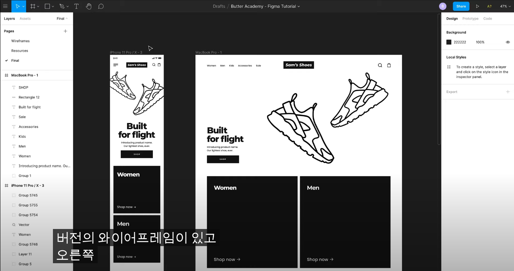
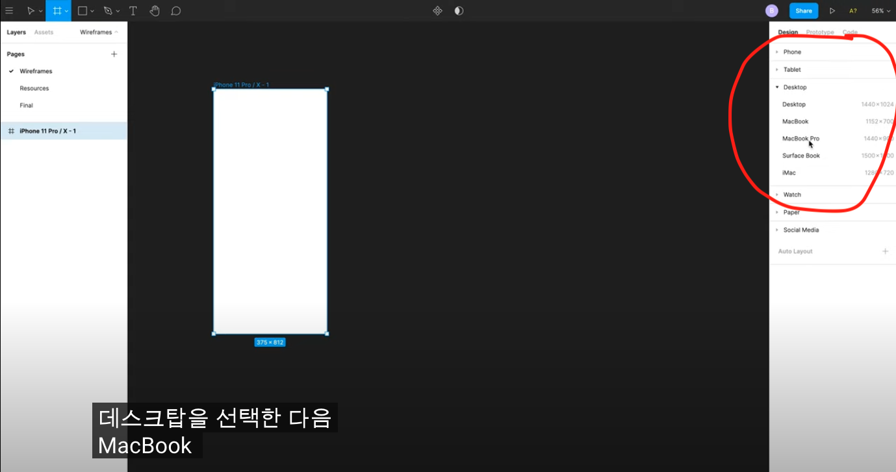
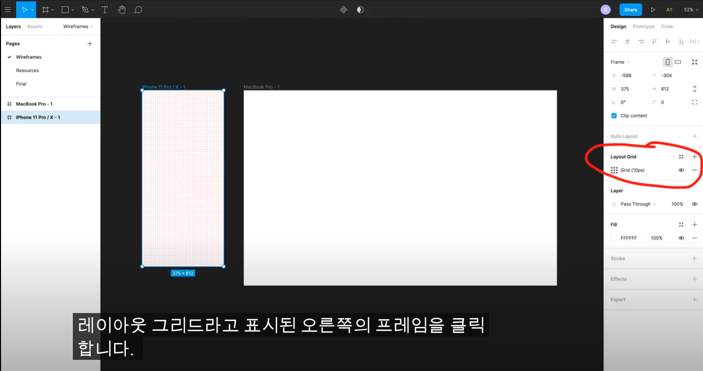
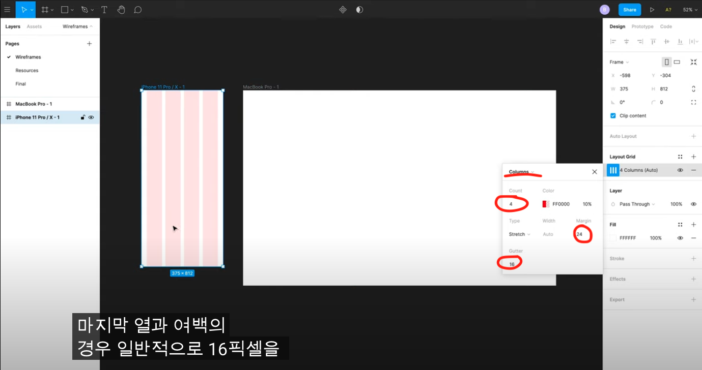
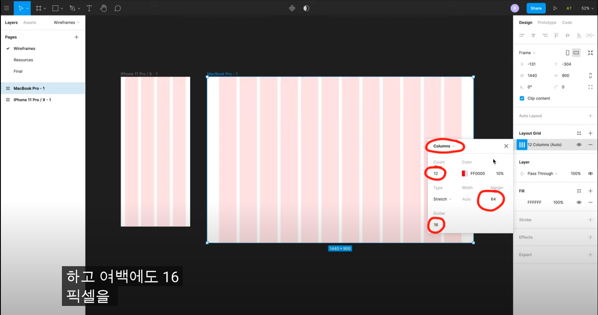
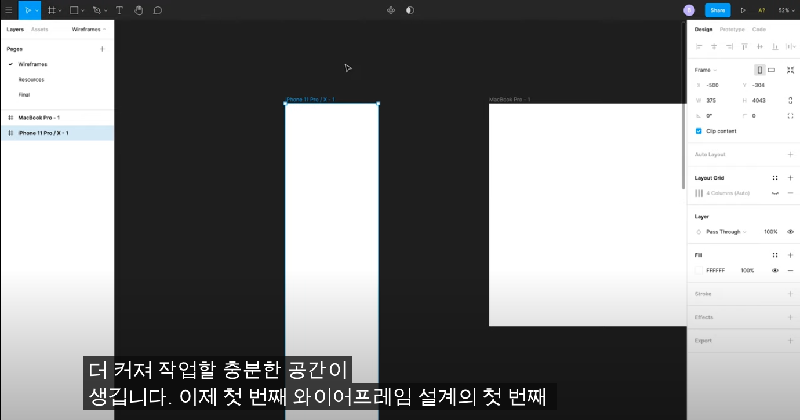
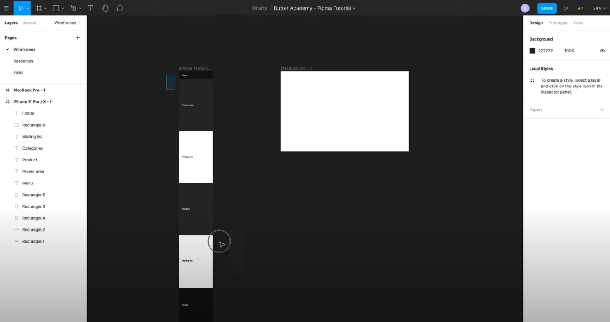
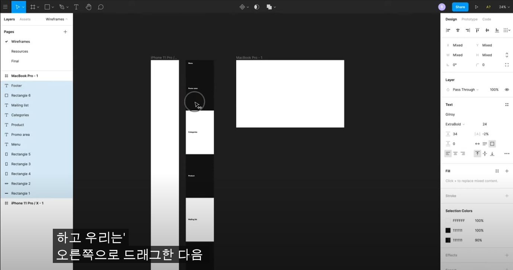
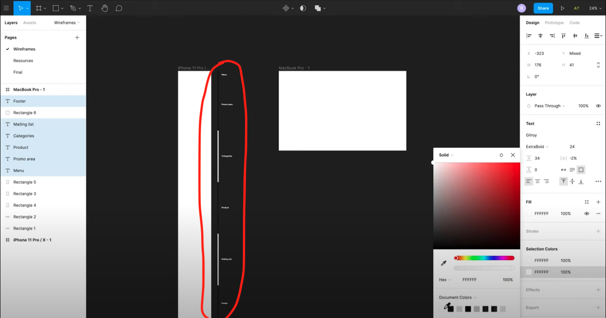

# Figma를 이용한 와이어프레임 작성법

Figma 와이어프레임 튜토리얼

> 출처: https://www.youtube.com/watch?v=6t_dYhXyYjI

## Designing Wireframes

보통 와이어프레임을 만들때에는 **모바일 버전** 과 **데스크탑 버전** 두 가지를 만든다.

새 프레임을 만드려면

[F]를 눌러서 프레임을 선택해서 원하는 프레임 셀렉.

## Layout Grids

프레임을 만들었으면 레이아웃 격자를 이용하여 그리드를 만들어라.

개체를 정렬하는데 도움이 되기 때문이다.

모바일 같은 경우 그리드는 다음과 같이 설정한다.

데스크탑같은 경우 그리드는 다음과 같이 설정한다.

이러한 그리드 시스템을 쉽게 끄고 킬 수 있다.

* MAC : control + G
* WINDOW : ctrl + shift + G

## Content Blocks

1. 모바일 버전의 경우 height 요소를 과감하게 늘려서 작업하기 편하게 만들어라.

2. 섹션을 나누어라

사각형 모양의 콘텐츠를 사용하여 섹션을 나누자.

사각형 모양의 콘텐츠를 만드는 단축키로는 

* MAC : R
* WINDOW: R

만든 사각형 콘텐츠를 사용하고 나서 그 사본을 얻고 싶다면?

* MAC : option
* WINDOW : alt

사진과 같이 콘텐츠 블럭을 생성 후 오른쪽으로 드래그.

그리고 다음과 같이 만들어서 섹션 구역을 정확하게 표시하여라

## MENU

> TIP: 아이콘 같은 경우는 https://thenounproject.com/ 를 참고

아이콘을 다운로드 할 때에는 SVG를 추천한다. --> 크기를 원하는 만큼 변경해도 깨지지가 않는다.

